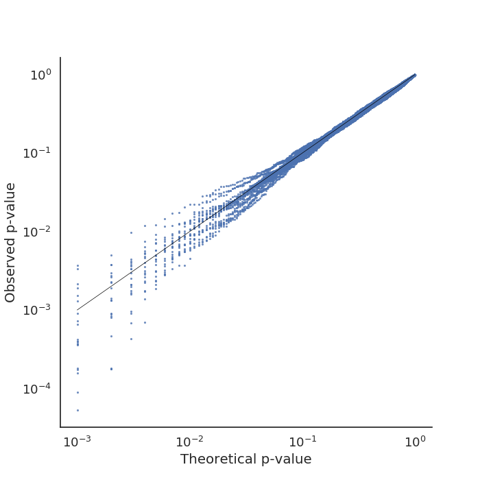
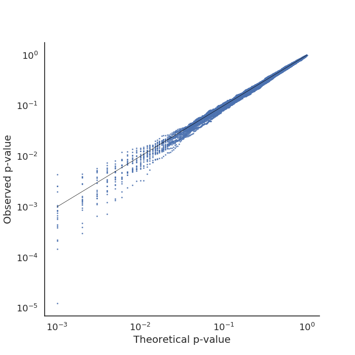
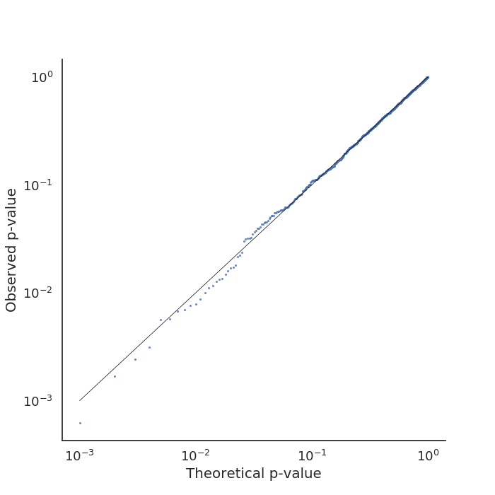
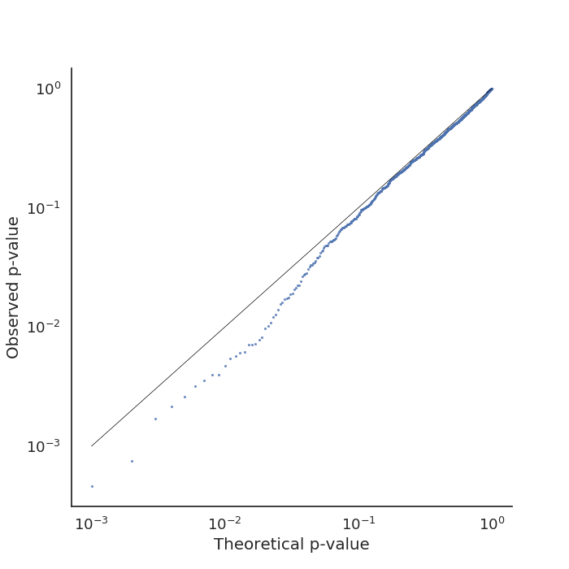
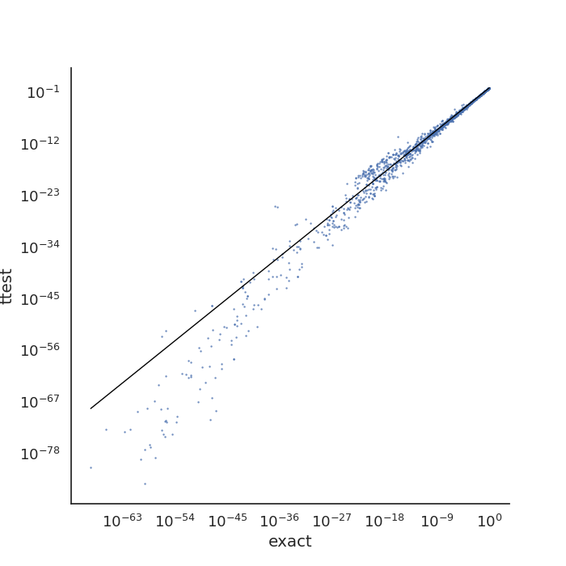
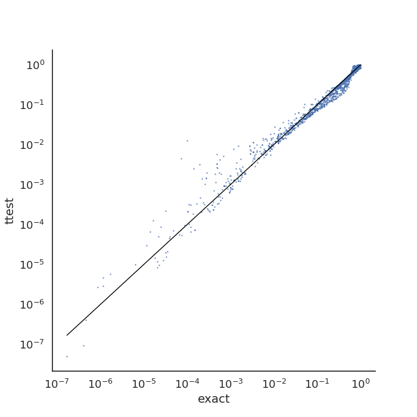
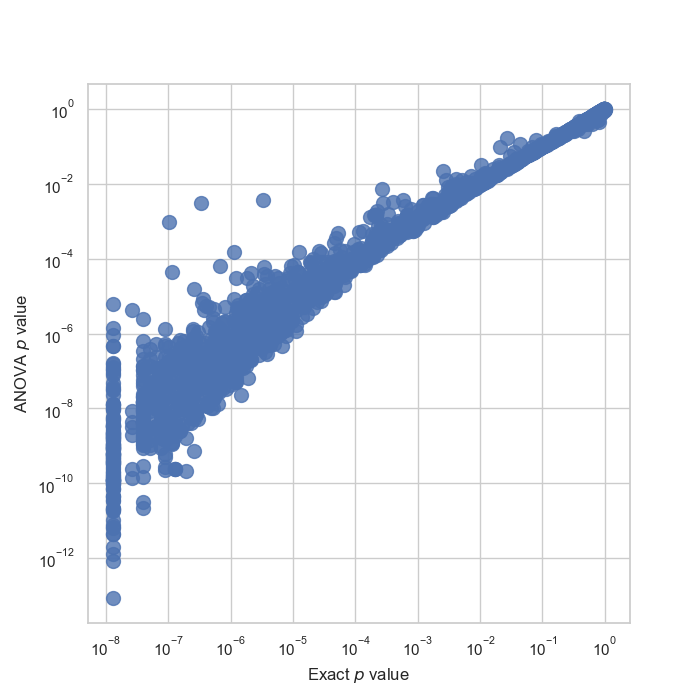
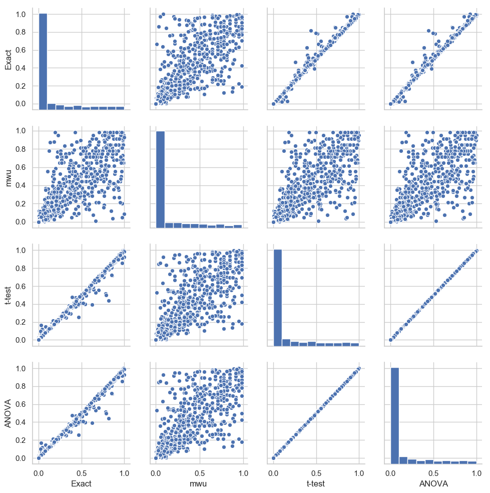

# Notebook for exactpermutation project

## 2019-05-22 Repeated calibration tests

I repeated the calibration test 20 times using the following code,[../exp/multiple_calibration/multiple_run_calibration.py](../exp/multiple_calibration/multiple_run_calibration.py). For  beta(2,5) I get:

.. and for beta(0.5,0.5) I get:

## 2019-05-15 Calibration tests

I implemented a calibration test for any given distribution [../src/calibration_test.py](../src/calibration_test.py). Testing it for a beta(2,5) distribution gave the following plot:

.. and a beta(0.5,0.5) distribution gave the following plot:

## 2019-03-25 TCGA data

Despite parallelization of [../src/scatter_plots.py](../src/scatter_plots.py), the execution on the TCGA dataset is rather slow. The results seem to suggest that the very lowest $p$ values are anti-conservative.

## 2019-03-06 Testing with CLL data

I refurbished the ploting scripts so that they save their $p$ value data. Scipt found at  [../src/scatter_plots.py](../src/scatter_plots.py).

Running with CLL data gave the following calibration plot:

It looks like the ANOVA model has a decent calibration.

## 2019-02-24B Testing with real data

I modified the script to  [../exp/ms_patrients/ms_scatter.py](../exp/ms_patrients/ms_scatter.py) to operate on RT's p-values, instead of my own t-test p-values.

## 2019-02-24 Testing with real data

After a long wait I received RT's data that he used for his calibration tests. I used a script [../exp/ms_patrients/ms_scatter.py](../exp/ms_patrients/ms_scatter.py) to check the calibration of t-tests against my exact test.

## 2019-02-19 Generated scatter plot

I tested 500 draws of 2-sample comparisons with 25 picks each from 2 normal distributions with slightly
shifted means. I tested this against my exact test, a mann-whiteney u-test and a standard t-test. The script
found in
[../src/method_scatter.py](../src/method_scatter.py), committed as 8b9e8b.

It seems like my exact test follows the t-test pretty well for these normal distributed data.

## 2019-02-18 First version
I implemented a first running prototype of the code, and checked it in as meanperm.py
