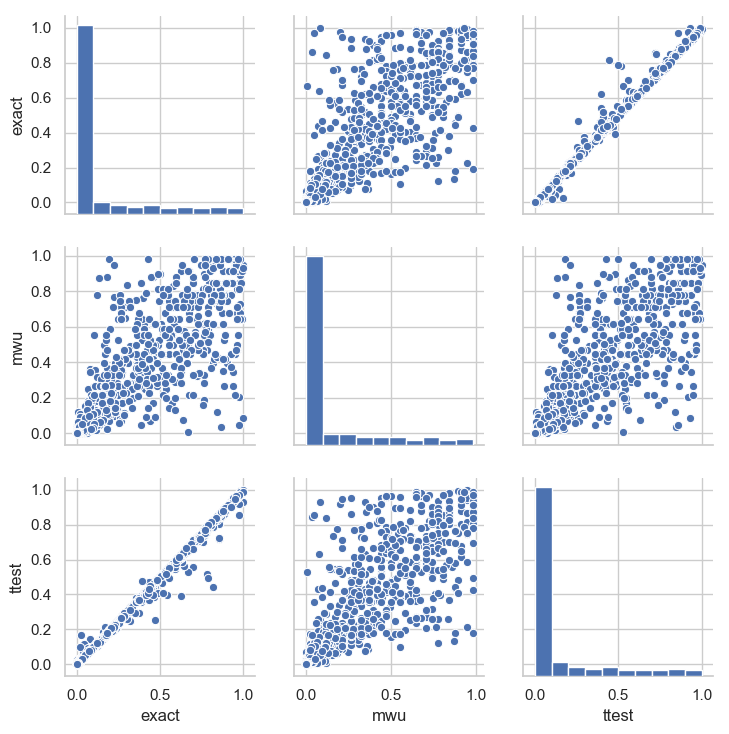
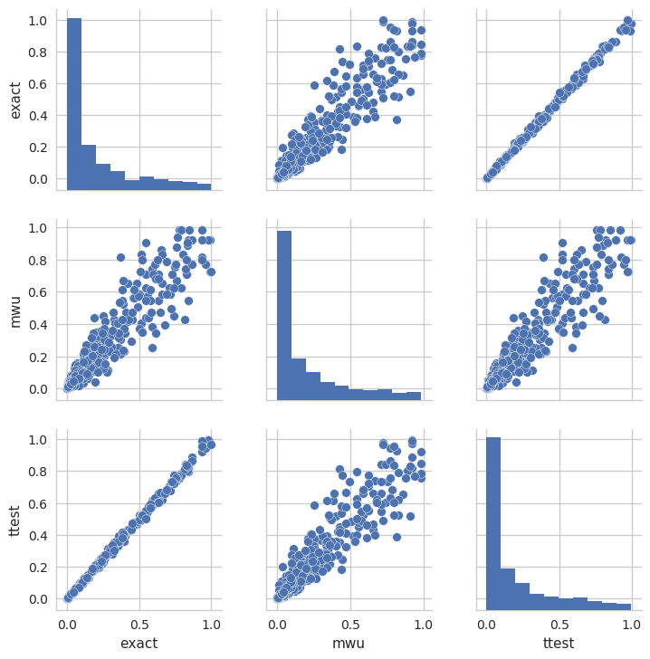

# Notebook for exactpermutation project

## 2019-02-24 Testing with real data

After a long wait I received RT's data that he used for his calibration tests. I used a script [../exp/ms_patrients/ms_scatter.py](../exp/ms_patrients/ms_scatter.py) to check the calibration of t-tests against my exact test.

## 2019-02-19 Generated scatter plot

I tested 500 draws of 2-sample comparisons with 25 picks each from 2 normal distributions with slightly
shifted means. I tested this against my exact test, a mann-whiteney u-test and a standard t-test. The script
found in
[../src/method_scatter.py](../src/method_scatter.py), committed as 8b9e8b.

It seems like my exact test follows the t-test pretty well for these normal distributed data.

## 2019-02-18 First version
I implemented a first running prototype of the code, and checked it in as meanperm.py
